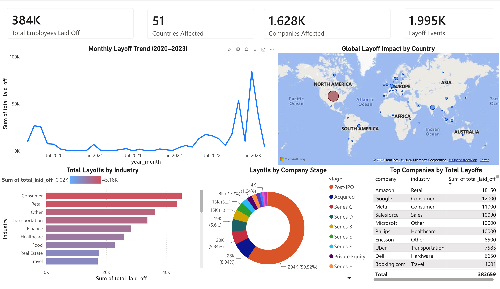

# Tech Industry Downsizing Analytics 📉

An end-to-end data engineering and analytics project investigating global tech layoffs (2020–2023). This project transforms raw, unstructured layoff announcements into a clean, actionable Power BI dashboard for workforce risk assessment and industry trend analysis.



## 🛠️ Tech Stack
- **Data Processing & Cleaning:** Python (Pandas, NumPy)
- **Database & Querying:** SQL 
- **Exploratory Data Analysis (EDA):** Matplotlib, Seaborn
- **Visualisation & BI:** Power BI

## 📊 Key Insights Discovered
After cleaning and processing **2,361 raw records** spanning 50+ countries, the following macro-economic trends were identified:
- **Total Impact:** 383,659 employees laid off globally.
- **Peak Disruption:** January 2023 saw the highest single-month spike in layoffs.
- **Hardest Hit Sector:** The **Consumer** and **Retail** industries experienced the most severe workforce reductions.
- **Geographic Concentration:** The **United States** accounted for the vast majority of global layoffs, driven heavily by Silicon Valley tech giants (Amazon, Google, Meta).
- **Company Stage Risk:** Post-IPO companies were responsible for over 50% of total layoffs, indicating that late-stage corporate restructuring was a primary driver over early-stage startup failure.

## 🚀 Pipeline Architecture

1. **Data Cleaning (`data_cleaning.py`)**
   - Removed duplicates and standardized categorical text fields (e.g., consolidating "Crypto" variants).
   - Handled missing data via forward-fill imputation for industries based on company mappings.
   - Parsed date strings into datetime objects and cast numerical columns for aggregation.
   - *Result: Reduced 2,361 raw rows to 1,995 high-quality, queryable records.*

2. **Exploratory Data Analysis (`eda_analysis.py`)**
   - Conducted statistical grouping to identify top companies, industries, and temporal trends.
   - Exported aggregated CSVs specifically structured for Power BI dimensional modeling.
   - Generated static Matplotlib/Seaborn charts for ad-hoc reporting (see `/charts` directory).

3. **Dashboarding (Power BI)**
   - Built an interactive, executive-facing dashboard focusing on KPI tracking and cross-filtering by geographic and sector dimensions.

## 📂 Repository Structure
```text
EDA/
├── DATA CLEANING/
│   ├── layoffs.csv                 # Raw dataset
│   └── Data Cleaning.sql           # SQL cleaning queries
├── powerbi_exports/                # Aggregated outputs for BI ingestion
├── charts/                         # Python-generated EDA visualizations
├── data_cleaning.py                # Python ETL cleaning pipeline
├── eda_analysis.py                 # Python aggregation & charting script
└── README.md                       # Project documentation
```

## ⚙️ How to Run Locally
Ensure you have Python 3.9+ installed.

```bash
# 1. Install dependencies
pip install pandas numpy matplotlib seaborn

# 2. Run the cleaning pipeline
python data_cleaning.py

# 3. Generate EDA insights and Power BI exports
python eda_analysis.py
```
